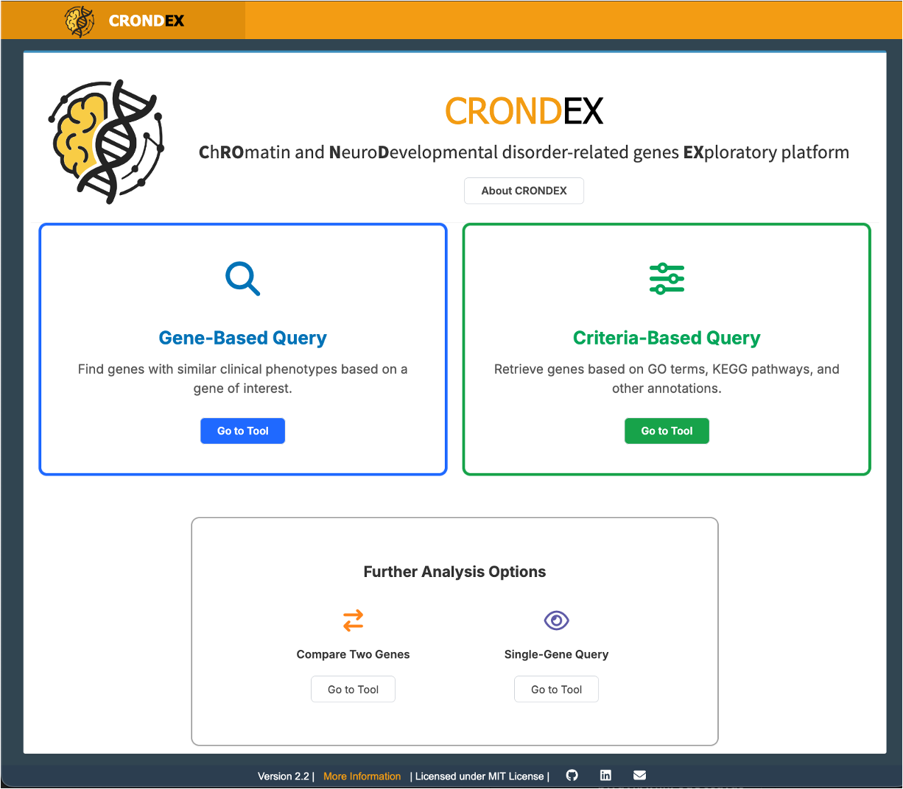

# CRONDEX: A Platform for Chromatin-Related NDDs

**CRONDEX** is a web-based platform developed to explore the relationships between chromatin-related genes and neurodevelopmental disorders (NDDs). This tool accompanies the research presented in **Guerrero et al. (2026)**: *"CRONDEX: a web-based platform for exploring links between chromatin-related genes and neurodevelopmental disorders"*.

The platform integrates data from **SysNDD** and **EpiFactors** to allow researchers to identify biologically coherent gene modules and formulate hypothesis-driven questions about the molecular basis of NDDs.



## Core Modules

As described in the associated publication, CRONDEX features two primary query modes designed to navigate the phenotypic and functional landscape of NDD proteins:

### 1. Gene-Based Query
*From paralogs to functional modules.*
**(App Tab: Single Gene Query)**

This module enables users to identify chromatin-related NDD genes that share clinical features with a gene of interest. By leveraging phenotypic similarity (based on Human Phenotype Ontology annotations), this tool can uncover:
-   **Paralogous pairs** with overlapping clinical presentations (e.g., *CREBBP* and *EP300*).
-   **Functionally convergent modules**, such as the BAFopathies (*SMARCA2*, *SMARCA4*, etc.), where different genetic causes lead to similar syndromic outcomes.

### 2. Criteria-Based Query
*Hypothesis-driven exploration.*
**(App Tab: Criteria-Based Search)**

This module allows users to filter the database based on specific functional and clinical criteria. It is designed to test hypotheses about the intersection of biological processes and disease phenotypes.
-   **Example Application**: Exploring the intersection of "Intellectual Disability" with specific chromatin modifications (e.g., histone methylation) or metabolic pathways (e.g., thermogenesis), to identify potential molecular links between chromatin regulation and systemic phenotypes.

## Online Access

**The easiest way to use CRONDEX is via the online version, which requires no installation:**

👉 **[Access CRONDEX Online](https://jgf-bioinfo.shinyapps.io/CRONDEX/)**

---

## Installation and Usage

If you prefer to run the application locally (e.g., for reproducible research or offline use), follow these steps:

### Prerequisites
- R (version 4.0 or higher)
- R packages listed in `requirements.txt`

### Local Installation

1.  **Clone the repository**:
    ```bash
    git clone https://github.com/yourusername/CRONDEX.git
    cd CRONDEX
    ```

2.  **Install dependencies**:
    You can install the required packages manually in R:
    ```r
    install.packages(c("shiny", "shinydashboard", "shinyWidgets", "DT", "tidyverse",
                       "ggrepel", "visNetwork", "upsetjs"))
    # See requirements.txt for the full list
    ```

3.  **Run the App**:
    ```r
    shiny::runApp()
    ```

## Citation

If you use CRONDEX in your research, please cite:

> **Guerrero, J., Viegas, B.S., Martínez-Balbás, M., & de la Cruz, X. (2026).** *CRONDEX: a web-based platform for exploring links between chromatin-related genes and neurodevelopmental disorders*. Research (VHIR), Universitat Autònoma de Barcelona.

## License

This project is licensed under the MIT License - see the [LICENSE](LICENSE) file for details.
